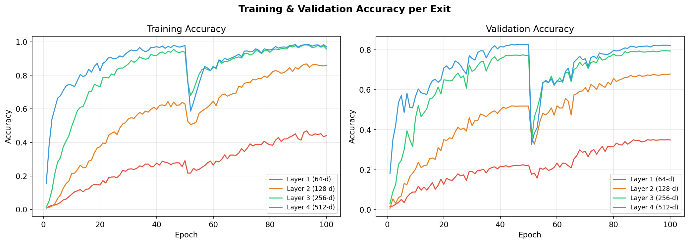
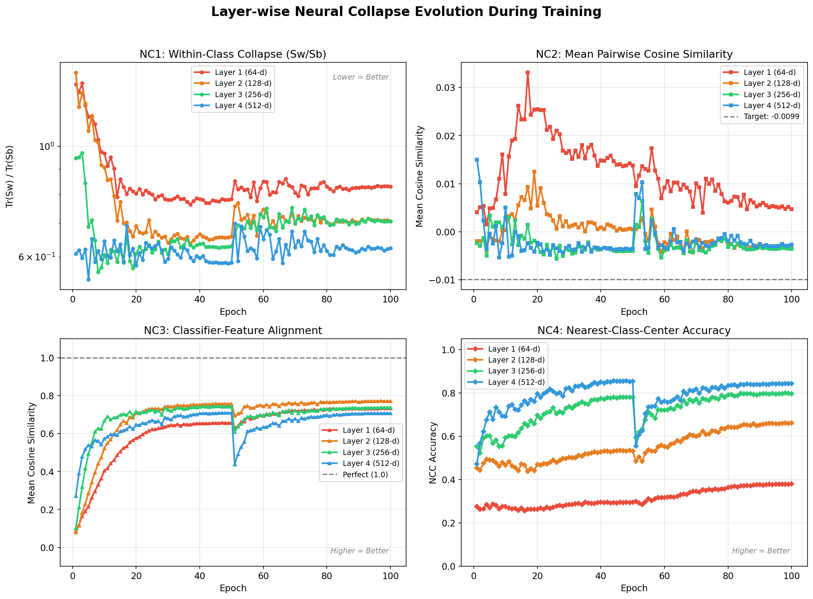

# 🧠 Feature Representation Dynamics and Reliability in Deep Neural Image Classification

**Investigating Neural Collapse Geometry and Its Implications for Early Exiting in Convolutional Neural Networks on Fine-Grained Visual Classification**

> REU (Research Experience for Undergraduates) Project — KLE Tech / Summer 2026

---

## 📌 Overview

This project investigates how **Neural Collapse (NC)** — a geometric phenomenon where deep network representations converge to a highly symmetric structure during terminal-phase training — develops **layer-by-layer** through a ResNet architecture, and how this progression affects the reliability of **Early Exit** classifiers.

While Neural Collapse is well-documented at the **final layer**, its behavior across **intermediate layers** remains poorly understood. This gap is critical because Early Exiting strategies (which halt inference at shallow layers when confidence is high) fundamentally depend on the quality of intermediate representations.

### Core Research Questions

1. **How does Neural Collapse evolve layer-by-layer** through a ResNet trained on fine-grained classification?
2. **How does collapse strength at intermediate layers affect Early Exit reliability?**
3. **What is the interplay between geometric complexity, class imbalance, and collapse completeness?**

---

## 📚 Foundation Papers

| Paper | Venue | Key Insight |
|-------|-------|-------------|
| **Liu & Qin** — OOD Detection via NC | CVPR 2025 | Strong collapse geometry enables reliable distance-based OOD detection |
| **Wang et al.** — Debiased Learning via NC | CVPR 2024 | Shortcut learning distorts the ideal simplex geometry |
| **Munn et al.** — Geometric Complexity in Transfer Learning | arXiv 2024 | Collapse strength depends on dataset geometric complexity |
| **Hasegawa & Sato** — Multiplicative Logit Adjustment | arXiv 2024 | Class imbalance distorts collapse; logit scaling can repair it |

**Common gap:** All four papers treat NC as a final-layer phenomenon. None study how collapse develops progressively through intermediate layers or connect this to Early Exiting.

---

## 🏗️ Architecture

### EarlyExitResNet

A modified **ResNet-18** (pretrained on ImageNet) with lightweight exit classifiers attached at each residual block boundary:

```
Input Image (3×224×224)
    │
    ▼
┌─ Stem (conv1 → bn1 → relu → maxpool) ─┐
│                                          │
├─ Layer 1 (64-d)  → Exit 1 (AdaptiveAvgPool → Linear → 102 classes)
├─ Layer 2 (128-d) → Exit 2 (AdaptiveAvgPool → Linear → 102 classes)
├─ Layer 3 (256-d) → Exit 3 (AdaptiveAvgPool → Linear → 102 classes)
└─ Layer 4 (512-d) → Exit 4 (AdaptiveAvgPool → Linear → 102 classes)
```

At inference time, `forward_early_exit()` halts computation as soon as any exit exceeds a confidence threshold — saving compute by skipping deeper layers.

---

## 📐 Neural Collapse Metrics (NC1–NC4)

All four NC properties are computed at **every layer** and **every epoch**:

| Metric | What It Measures | Ideal Value | Formula |
|--------|-----------------|-------------|---------|
| **NC1** | Within-class variability collapse | → 0 | Tr(Σ_W) / Tr(Σ_B) |
| **NC2** | Simplex ETF (equiangular tight frame) | cos = −1/(C−1) | Pairwise cosine similarity of centered class means |
| **NC3** | Classifier-feature alignment | → 1.0 | Cosine similarity between W_c and (μ_c − μ_G) |
| **NC4** | Nearest-class-center accuracy | → trained acc | NCC classification accuracy (no learned weights) |

---

## 📊 Results Summary

### Training: 100 epochs on Oxford Flowers 102

| Exit | Val Accuracy (Final) | Best Val Accuracy | Best Epoch |
|------|---------------------|-------------------|------------|
| Exit 1 (Layer 1, 64-d) | 34.90% | 35.03% | 99 |
| Exit 2 (Layer 2, 128-d) | 67.88% | 67.88% | 100 |
| Exit 3 (Layer 3, 256-d) | 79.35% | 79.51% | 98 |
| Exit 4 (Layer 4, 512-d) | 82.06% | **82.68%** | 47 |

### Final Neural Collapse Metrics (Epoch 100)

| Layer | NC1 (↓ better) | NC2 mean cos | NC3 (↑ better) | NC4 (↑ better) |
|-------|----------------|--------------|----------------|----------------|
| 1 | 0.8308 | 0.0047 ± 0.42 | 0.7336 | 0.3804 |
| 2 | 0.7074 | −0.0034 ± 0.31 | 0.7722 | 0.6616 |
| 3 | 0.7066 | −0.0036 ± 0.24 | 0.7376 | 0.7969 |
| 4 | 0.6236 | −0.0027 ± 0.18 | 0.7075 | **0.8436** |

**Key finding:** NC1 decreases and NC4 increases monotonically with depth — deeper layers exhibit progressively stronger Neural Collapse, consistent with theory and directly correlated with Early Exit accuracy.

### Training Curves

<p align="center">
  
</p>

### Neural Collapse Evolution

<p align="center">
  
</p>

---

## 🗂️ Project Structure

```
REU/
├── README.md                          # This file
├── .gitignore
├── problem_statement.md               # Full research problem, motivation & objectives
├── neural_collapse_summary.md          # Literature review summary
├── mathematical_formulation.md         # NC1-NC4 mathematical definitions
│
├── src/
│   ├── model.py                       # EarlyExitResNet architecture
│   ├── dataset.py                     # Data loading (Flowers-102, CIFAR-10)
│   ├── train.py                       # Training loop with NC metrics & checkpointing
│   ├── evaluate.py                    # Evaluation, early exit simulation, OOD detection
│   ├── nc_metrics.py                  # NC1-NC4 metric implementations
│   ├── feature_extractor.py           # Feature extraction bridge (model → metrics)
│   ├── visualize.py                   # Publication-quality plotting
│   ├── run_experiments.py             # Full experiment pipeline runner
│   │
│   └── results/
│       ├── metrics/full_history.json  # Complete training history (100 epochs)
│       ├── plots/                     # Generated figures
│       │   ├── nc_evolution.png       # NC1-NC4 across epochs & layers
│       │   ├── accuracy_curves.png    # Train/val accuracy per exit
│       │   ├── loss_curve.png         # Train/val loss
│       │   ├── confidence_histograms.png
│       │   ├── exit_sweep.png         # Accuracy vs speedup tradeoff
│       │   └── nc_vs_accuracy.png     # Core hypothesis: NC strength ↔ exit accuracy
│       └── checkpoints/               # Per-epoch history JSONs (model .pt files gitignored)
│
├── check_progress.py                  # Quick training progress checker
├── create_ppt.py                      # Presentation generation scripts
├── create_ppt_v2.py
├── create_results_ppt.py
├── extend_presentation.py
│
└── data/                              # Datasets (gitignored, auto-downloaded)
    ├── cifar-10-batches-py/
    └── flowers-102/
```

---

## 🚀 Getting Started

### Prerequisites

```bash
pip install torch torchvision numpy scipy matplotlib
```

### Train the Model

```bash
cd src
python train.py
```

Trains for 100 epochs with cosine annealing LR, computing NC metrics at every epoch. Checkpoints are saved after each epoch.

### Resume Training

```bash
python train.py --resume results/checkpoints/model_epoch_50.pt
```

### Run Full Evaluation

```bash
python run_experiments.py --checkpoint results/checkpoints/model_epoch_100.pt
```

Runs: per-exit accuracy, early exit simulation, OOD detection, confidence analysis, and generates all plots.

### Generate Plots from Saved History

```bash
python visualize.py results/metrics/full_history.json
```

---

## 🔬 Experimental Pipeline

```
Oxford Flowers 102 (102 fine-grained classes, ~8K images)
        │
        ▼
  ResNet-18 (ImageNet pretrained, fine-tuned)
        │
        ├── Layer1 → Exit 1 → NC metrics + confidence
        ├── Layer2 → Exit 2 → NC metrics + confidence
        ├── Layer3 → Exit 3 → NC metrics + confidence
        └── Layer4 → Exit 4 → NC metrics + confidence
                                    │
                                    ▼
                          ┌─────────────────────┐
                          │ Cross-Analysis:      │
                          │ • NC strength ↔ Acc  │
                          │ • OOD detection      │
                          │ • Logit adjustment   │
                          │ • Bias detection      │
                          └─────────────────────┘
```

---

## 📋 Research Objectives Status

### Primary Objectives

- [x] **Quantify layer-wise Neural Collapse** — NC1-NC4 computed at all 4 residual blocks across 100 epochs
- [x] **Implement Early Exit classifiers** — Lightweight classifiers at each block boundary with confidence-gated inference
- [x] **Establish NC ↔ Exit reliability correlation** — NC4 and exit accuracy show strong positive correlation; NC1 shows negative correlation

### Secondary Objectives (Planned)

- [ ] **Geometric complexity comparison** — Compare collapse on Flowers-102 vs CIFAR-10 (infrastructure ready)
- [ ] **Multiplicative Logit Adjustment at early exits** — Code implemented, sweep pending
- [ ] **OOD detection at intermediate layers** — Evaluation pipeline implemented, full analysis pending
- [ ] **Extend to additional architectures** — DenseNet, EfficientNet, ViT comparison

---

## 🔮 Next Steps

1. **Run CIFAR-10 baseline** to validate Munn et al.'s geometric complexity findings
2. **MLA sweep** — Test logit adjustment at τ = {0.5, 1.0, 1.5, 2.0} across exits
3. **OOD detection analysis** — Quantify AUROC at each layer depth
4. **Paper writing** — Draft with layer-wise NC characterization as the central contribution

---

## 📖 References

1. Papyan, V., Han, X., & Donoho, D. L. (2020). *Prevalence of Neural Collapse during the terminal phase of deep learning training.* PNAS.
2. Liu, Y., & Qin, Y. (2025). *Detecting Out-of-Distribution through the Lens of Neural Collapse.* CVPR.
3. Wang, Z., et al. (2024). *Debiased Learning via Neural Collapse.* CVPR.
4. Munn, J., et al. (2024). *Geometric Complexity in Transfer Learning.* arXiv.
5. Hasegawa, T., & Sato, I. (2024). *Multiplicative Logit Adjustment for Neural Collapse.* arXiv.

---

## 👤 Author

**Aditya Arasamangalam**  
REU Research Intern — Summer 2026
